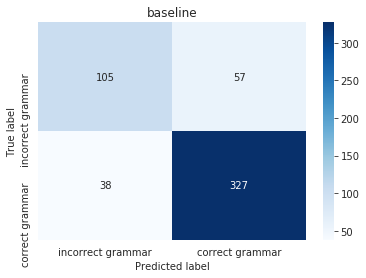
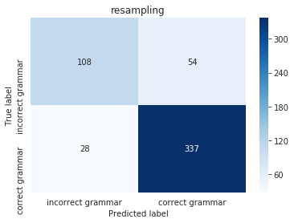
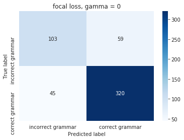
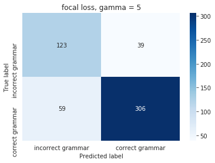
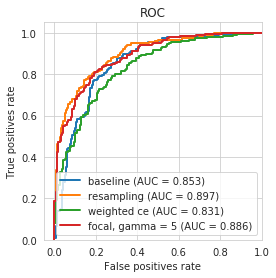
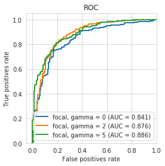
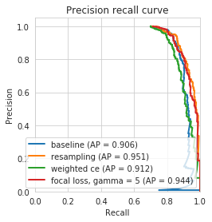
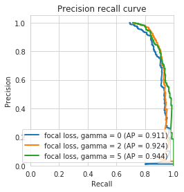
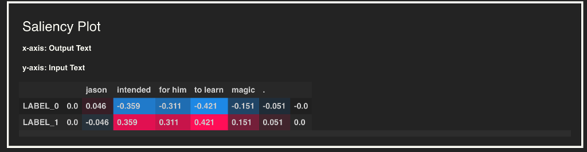
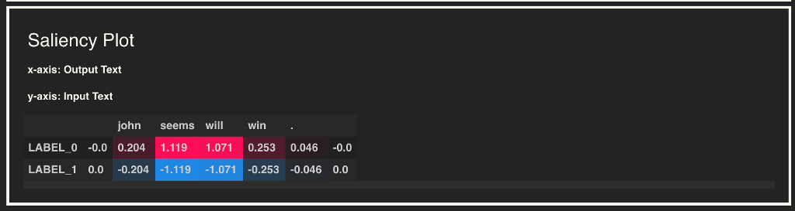

## Text classification on the CoLA (the Corpus of Linguistic Acceptability) dataset
 

#### Dataset
[CoLA (the Corpus of Linguistic Acceptability)](https://nyu-mll.github.io/CoLA/)
The Corpus of Linguistic Acceptability (CoLA) in its full form consists of 10657 sentences from 23 linguistics publications, expertly annotated for acceptability (grammaticality) by their original authors. The public version provided here contains 9594 sentences belonging to training and development sets, and excludes 1063 sentences belonging to a held out test set. Contact alexwarstadt [at] gmail [dot] com with any questions or issues. Read the [paper](https://arxiv.org/abs/1805.12471) or check out the [source code](https://github.com/nyu-mll/CoLA-baselines) for baselines.

 

#### Model
[AlbertForSequenceClassification](https://huggingface.co/transformers/v2.2.0/model_doc/albert.html?highlight=albertforsequenceclassification) with the [albert-base-v2](https://huggingface.co/albert-base-v2) pretrained model from the [HuggingFace](https://huggingface.co/) library is used to fine-tune text classification on the CoLA dataset.

 

#### Objective
Create a model trained on the CoLA dataset to predict whether a sentence is grammatically correct and minimize the misclassification of incorrect grammar cases.

 

#### Strategy for dealing with class imbalance
- Resample a balanced dataset by upsampling minority class and downsampling majority class
- Weight the classes for cross entropy loss
- Employ a focal loss to downweight easily classified samples and upweight difficult sample

 

#### Evaluation metrics for comparing class imbalance strategies
- Confusion matrix
- Precision
- Recall
- AUC

### Results

#### Precision, recall, F1 metrics

| Model | Class | Precision | Recall | F1 |
| --- | --- | --- | --- | --- |
| baseline | incorrect grammar | 0.73 | 0.65 | 0.69 |
| baseline | correct grammar | 0.85 | 0.90 | 0.87 |
| resampled | incorrect grammar | 0.79 | 0.67 | 0.72 |
| resampled | correct grammar | 0.86 | 0.92 | 0.89 |
| weighted cross entropy | incorrect grammar | 0.66 | 0.62 | 0.64 |
| weighted cross entropy | correct grammar | 0.84 | 0.86 | 0.85 |
| focal loss, gamma=0 | incorrect grammar | 0.70 | 0.64 | 0.66 |
| focal loss, gamma=0 | correct grammar | 0.84 | 0.88 | 0.86 |
| focal loss, gamma=2 | incorrect grammar | 0.76 | 0.66 | 0.71 |
| focal loss, gamma=2 | correct grammar | 0.86 | 0.91 | 0.88 |
| focal loss, gamma=5 | incorrect grammar | 0.68 | 0.76 | 0.72 |
| focal loss, gamma=5 | correct grammar | 0.89 | 0.84 | 0.86 |

##### Comments
Model with resampling shows improvement over the baseline for precision, recall, and F1 score for both minority and majority classes.

Model with focal loss (gamma=5) increases the recall (+11) and F1 (+3) score of the minority class (incorrect grammar cases) compared with baseline.

 

#### Confusion matrices

##### Comments

When dealing with class imbalance of the CoLA dataset, my main focus was minimizing misclassification of incorrect grammar sentences. With the model trained using the focal loss and gamma = 5, the number of incorrect grammar cases classified correctly increased by 18 compared with baseline (105 to 123), and conversely, the number of incorrect grammar cases that are misclassified reduced by 18 compared with baseline (57 to 39). As expected, this also led to an increase in false negatives (correct grammar cases classified as incorrect grammar).

 

#### AUC and PR metrics

| Model | AUC | PR |
| --- | --- | --- |
| baseline | 0.853 | 0.906 |
| resampled | 0.897 | 0.951 |
| weighted cross entropy | 0.831 | 0.912 |
| focal loss, gamma=0 | 0.841 | 0.911 |
| focal loss, gamma=2 | 0.876 | 0.924 |
| focal loss, gamma=5 | 0.886 | 0.944 |

 

#### Prediction explainability samples with SHAP

